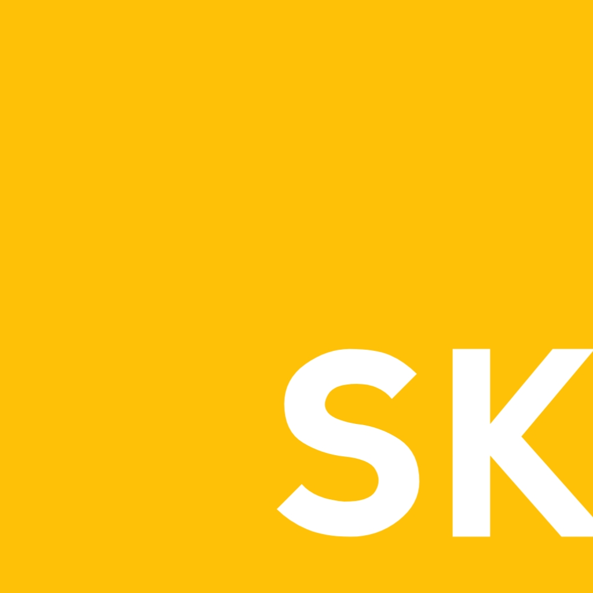

<p align="center">
   
</p>
<p align="center">skai programming language</p>

# oreview:
skai-lang is a hobby dynamicaly typed programming language made for scripting. [W.I.P]

## syntax:
### Hello, World:
```sk
print("Hello, World!");
```

### arithmeric operations:
```sk
print(3 - 2);  // 1
print(5 * 2); // 10
```

### variables:
variables are defined/declared using `let` keyword:
```sk
let str = "hello, world!";
print(str);

// or
let str; // default value is set to null

str = "hello, world!";
print(str);

// there are also immutable variables and they are declared with the keyword `imm`
let imm PI = 22/7;
let imm r = 4;
print("surface is", r*pi*4);

PI = 0; // error can't assign to immutable variables
```

### loops:
```sk
for let i = 0; i <= 10; i += 1 {
    print("i is", i);
}

// or with a while loop

while let i = 0; i <= 10 {
    print("i is", i);
    i += 1;
}
```

# installation:
```shell
$ git clone https://github.com/dammi-i/skai-lang
$ cd skai-lang
$ cmake . -B ./build
$ cd ./build && make && make install
```

# goals:
- [ ] make the language usable
- [ ] fix immutable
- [ ] lambdas
- [ ] catch overflows and underflows
- [ ] catch seg faults
- [ ] operator precedence
- [ ] fix string escape charachters
- [ ] fix return
- [ ] unicodes
- [ ] exceptions
- [ ] better error messages
- [ ] range expressions
- [ ] fix default arguments
- [ ] keyword args
- [ ] support for loops and classes
- [ ] enums
- [ ] modules
- [ ] standard library
- [ ] repl
- [ ] syntax highlights
